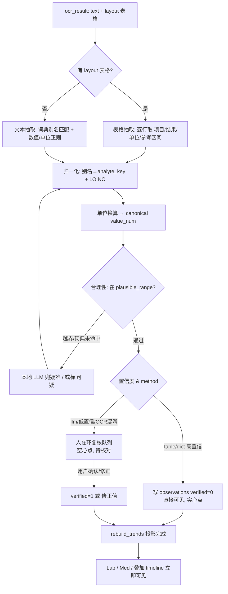

# 015 · Trends & Timelines · 纵向健康趋势

> **一句话立场:** MedMe 今天把**文档**按时间排成健康档案;医生真正的问题是纵向的——「**这一个指标**这三年怎么走?这个药怎么调的?」。所以我们从文档里抽出**结构化、带编码、带日期**的测量点,让用户围绕单一 analyte / 药物 / 疾病来**旋转视图**。
>
> 本文定义 1.0 的 **Lab timeline + Medication timeline + 叠加视图 + 实体搜索 + 归一化词典/抽取**,并为 1.1 的 **Disease timeline + 健康洞察** 埋接口。

关联:[003_Core_Data_Model](003_Core_Data_Model.md) · [004_Import_Pipeline](004_Import_Pipeline.md) · [005_AI_Principles](005_AI_Principles.md) · [009_Encounter_Model](009_Encounter_Model.md) · [011_Storage_Sync](011_Storage_Sync.md) · [012_Viewers_and_Rendering](012_Viewers_and_Rendering.md) · 记忆 `medme-content-aware-rendering` / `medme-real-data-sources`

---

## 1. 重构:从「文档」到「随时间的测量」

### 1.1 医生的心智模型

拿到一叠化验单/病历,医生**不是**从头读到尾。他的思路是纵向的、以「一件事」为轴:

- 「**肌酐**这三年是不是在爬?eGFR 掉了多少?」
- 「他**血压**控制得怎么样?换了 ARB 之后降了没?」
- 「**HbA1c** 从二甲双胍加到加 GLP-1 之后有没有下来?」

这些问题的答案都不在**任何单一文档**里——它们是同一个量 **跨多份文档、跨多次就诊** 的**序列**。今天的 MedMe(见 [009_Encounter_Model](009_Encounter_Model.md))把 document 排成时间线,回答的是「**这次**看了什么」;趋势视图要回答的是「**这个东西**一直怎么样」。这是一次**主轴转置**:

```
今天(文档轴):   时间 ──► [化验单A] [出院小结] [化验单B] [处方] ...
                              每份文档是一个原子

趋势(测量轴):   肌酐  ── 88 ── 96 ── 112 ── 105 (µmol/L)  ← 一条线穿过多份文档
                 eGFR  ── 82 ── 74 ── 61 ── 66
                 缬沙坦 ▓▓▓▓▓▓▓▓▓▓▓▓▓▓▓▓▓▓▓▓ (80mg qd → 160mg qd)
                       └──────────── 同一条时间轴 ────────────►
```

### 1.2 为什么现在做

- v0.1/v0.2 已经把**原件永存 + OCR 文本 + 内容感知渲染(化验单→表格)**跑通(见 `medme-content-aware-rendering`)。表格化的化验单已经是**半结构化**的,离「抽成数据点」只差一步。
- 用户反复强调:**「trends > single signals,真正的价值是序列而非孤点」**。这是 MedMe 从「更好看的文件夹」升级为「**能回答临床问题的工具**」的分水岭。
- 数据现实(见 `medme-real-data-sources`):患者手里主要是**手机拍的化验单 + PDF**。化验单是**最结构化、最高价值**的一类——先啃它,ROI 最高。

### 1.3 设计红线(贯穿全文)

1. **抽错比不画更危险。** 一条画错的肌酐曲线会误导临床决策。宁**少而准**,不多而糊。
2. **永远可溯源。** 每个数据点都能一键跳回**源报告的原图 + 高亮字符区间**,并显示 **OCR/抽取置信度**。延续 [005_AI_Principles](005_AI_Principles.md) 铁律 2/4。
3. **派生、可重建。** 趋势层是**纯派生**,从 CAS + 事件日志重放得到(见 [011_Storage_Sync](011_Storage_Sync.md)),删库可重建、换模型可重跑。

---

## 2. 数据模型

### 2.1 定位:第三层派生(L3-Trends)

沿用既有分层([003](003_Core_Data_Model.md) §1):**L1 Raw(CAS,真相)→ 事件日志(真相)→ L2 派生 DB**。趋势表是 **L2 之上的专用派生**,从 `clinical_event`(§003 已定义的归一化事件)**投影 + 归一化 + 单位换算**而来:

```
objects/ + log/   (真相,append-only,永存)
      │  materialize / replay
      ▼
clinical_event    (L2,通用归一化事件:lab_result / medication / …)
      │  project + normalize + unit-convert   ← 本文新增的一次投影
      ▼
observations · medications · conditions   (L3-Trends,趋势视图专用,可重建)
```

> **为什么单独建表而不直接查 `clinical_event`?** 趋势查询是「按 analyte 编码 + 时间排序」的高频窄查询,需要**规范化编码、换算到统一单位、对齐参考区间**。把这些固化进专用表 + 索引,查询简单、渲染直接;而且这层是**幂等投影**,`clinical_event` 变了就重投一遍。ponytail:不新造真相,只多一层为查询优化的派生。

这三张表**不进事件日志**(与 `encounter` 同理,见 [011](011_Storage_Sync.md) §2),`materialize` 时由 `rebuild_trends()` 计算。

### 2.2 `observations`(化验 + 生命体征)

一个 `observation` = **一个量在一个时刻的一个数值**(或定性结果)。这是 Lab timeline 的原子。

```sql
CREATE TABLE observations (
    id              INTEGER PRIMARY KEY,

    -- ── 归一化后的量(什么指标)──────────────────────────────
    analyte_key     TEXT    NOT NULL,   -- 内部规范键,如 'creatinine' / 'egfr' / 'hba1c'
    analyte_name    TEXT    NOT NULL,   -- 规范中文显示名,如 '肌酐'
    code_system     TEXT,               -- 'LOINC'(主)| 'local'
    code            TEXT,               -- 如 LOINC '2160-0'(Creatinine, serum)
    category        TEXT    NOT NULL,   -- 'lab' | 'vital'  (血压/心率/体重走 vital)

    -- ── 值(测量结果)────────────────────────────────────────
    value_num       REAL,               -- 数值结果(已换算到 canonical_unit)
    value_text      TEXT,               -- 定性/文本结果(如 '阴性' / '+' / '未见异常')
    unit            TEXT,               -- 本表统一后的规范单位(canonical),如 'µmol/L'
    value_raw       TEXT,               -- 原始串(换算前),如 '1.2 mg/dL' —— 保留可溯源
    unit_raw        TEXT,               -- 原始单位

    -- ── 参考区间 + 异常判定 ─────────────────────────────────
    ref_low         REAL,               -- 参考下限(canonical_unit)
    ref_high        REAL,               -- 参考上限
    ref_text        TEXT,               -- 原始参考区间串(如 '59-104')
    abnormal_flag   TEXT,               -- 'N' | 'H' | 'L' | 'HH' | 'LL' | 'A'(定性异常)| null

    -- ── 时间 ────────────────────────────────────────────────
    effective_date  TEXT    NOT NULL,   -- 采样/报告日期(RFC3339);趋势主轴
    date_precision  TEXT    NOT NULL DEFAULT 'day',  -- 'day'|'month'|'year'(OCR 只给到月时)

    -- ── ★ 可溯源 + 置信(红线 2/4)──────────────────────────
    source_doc_id   INTEGER NOT NULL REFERENCES document(id),
    source_ocr_id   INTEGER REFERENCES ocr_result(id),
    source_span     TEXT,               -- JSON {start,end} 字符偏移,跳回原文高亮
    source_cell     TEXT,               -- JSON {table_idx,row,col} 若来自 layout 表格
    ocr_confidence  REAL,               -- 源单元格 OCR 置信 0..1
    extract_confidence REAL,            -- 归一化/抽取置信 0..1
    extract_method  TEXT NOT NULL,      -- 'table'|'dict'|'llm'|'manual'
    verified        INTEGER NOT NULL DEFAULT 0,  -- 0=未确认 1=用户已核对(人在环)

    created_at      TEXT    NOT NULL
);
CREATE INDEX idx_obs_analyte_date ON observations(analyte_key, effective_date);
CREATE INDEX idx_obs_code         ON observations(code_system, code);
CREATE INDEX idx_obs_abnormal     ON observations(abnormal_flag) WHERE abnormal_flag NOT IN ('N');
CREATE INDEX idx_obs_source       ON observations(source_doc_id);
```

要点:
- **`value_num` 已换算到 `unit`(canonical)**,曲线不用在渲染时换算;`value_raw/unit_raw` 保留原始串以便溯源与复核。
- **参考区间随点存**(不同医院/性别/年龄参考值不同),阴影带按每点自己的 `ref_low/high` 画——不假设全序列同一区间。
- `date_precision`:手机拍的报告有时只认得出「2023-06」,别硬凑成 day;时间轴按精度画。

### 2.3 `medications`(用药)

一个 `medication` = **一段用药区间**(起→止),带剂量/途径/频次。这是 Medication timeline(甘特条)的原子。

```sql
CREATE TABLE medications (
    id              INTEGER PRIMARY KEY,

    -- ── 归一化后的药 ────────────────────────────────────────
    drug_key        TEXT    NOT NULL,   -- 内部规范键,如 'metformin' / 'valsartan'
    drug_name       TEXT    NOT NULL,   -- 规范中文名,如 '二甲双胍'
    ingredient      TEXT,               -- 活性成分英文,如 'Metformin'
    code_system     TEXT,               -- 'RxNorm'(成分/SCD)| 'ATC' | 'local'
    code            TEXT,               -- 如 RxNorm '6809' | ATC 'A10BA02'
    atc_class       TEXT,               -- ATC 药理分类(用于叠加视图分组/配色)

    -- ── 剂量 / 用法 ─────────────────────────────────────────
    dose_num        REAL,               -- 单次剂量数值,如 500
    dose_unit       TEXT,               -- 'mg' | 'IU' | 'mL' ...
    route           TEXT,               -- 'PO' | 'SC' | 'IV' | 'inhaled' ...
    frequency       TEXT,               -- 规范频次码 'qd'|'bid'|'tid'|'qn'|'prn'
    frequency_text  TEXT,               -- 原始频次串,如 '每日两次'

    -- ── 区间 / 状态 ─────────────────────────────────────────
    start_date      TEXT,               -- 起(RFC3339,可空)
    end_date        TEXT,               -- 止(空=推定持续/长期用药)
    status          TEXT NOT NULL,      -- 'active'|'stopped'|'completed'|'unknown'
    date_inferred   INTEGER NOT NULL DEFAULT 0,  -- 起止是否为推断(处方日/续方推出)

    -- ── ★ 可溯源 + 置信 ────────────────────────────────────
    source_doc_id   INTEGER NOT NULL REFERENCES document(id),
    source_ocr_id   INTEGER REFERENCES ocr_result(id),
    source_span     TEXT,
    ocr_confidence  REAL,
    extract_confidence REAL,
    extract_method  TEXT NOT NULL,      -- 'dict'|'llm'|'manual'
    verified        INTEGER NOT NULL DEFAULT 0,

    created_at      TEXT    NOT NULL
);
CREATE INDEX idx_med_drug   ON medications(drug_key, start_date);
CREATE INDEX idx_med_code   ON medications(code_system, code);
CREATE INDEX idx_med_atc    ON medications(atc_class);
CREATE INDEX idx_med_source ON medications(source_doc_id);
```

要点:
- **区间是难点**:一张处方只给「处方日 + 用法」,不给停药日。策略:`start_date` = 处方日;`end_date` 由 `剂量数量 ÷ 日用量` 估算或留空(`status=active`);同一 `drug_key` 后续再出现处方 → 视为**续方/调整**,前一段 `end_date` 收敛到新段 `start_date`(`date_inferred=1`)。**推断出的区间必须在 UI 标注为虚线/浅色**(别假装确定)。
- **剂量分段**:同药不同剂量 = 甘特条上**同一行的不同色段**(80mg→160mg),由多条 `medications` 记录拼成(按 `drug_key` group)。

### 2.4 `conditions`（疾病 / 诊断,1.1）

1.0 **只建空表、不写入**(与 §003 对 `clinical_event` 的处理一致:先建表减少后续 migration 冲击)。1.1 起由抽取写入,驱动 Disease timeline。

```sql
CREATE TABLE conditions (            -- [1.1]
    id              INTEGER PRIMARY KEY,
    condition_key   TEXT NOT NULL,    -- 内部规范键,如 'ckd' / 't2dm' / 'htn'
    condition_name  TEXT NOT NULL,    -- 规范中文名
    code_system     TEXT,             -- 'ICD-10' | 'SNOMED'
    code            TEXT,             -- 如 ICD-10 'E11'(2型糖尿病)
    status          TEXT,             -- 'active'|'resolved'|'in_remission'|'suspected'
    onset_date      TEXT,             -- 首次出现/确诊
    abatement_date  TEXT,             -- 缓解/治愈(可空)
    stage           TEXT,             -- 分期/分级,如 'CKD G3a' / 'NYHA II'
    -- ★ 可溯源 + 置信(同上)
    source_doc_id   INTEGER NOT NULL REFERENCES document(id),
    source_span     TEXT,
    extract_confidence REAL,
    verified        INTEGER NOT NULL DEFAULT 0,
    created_at      TEXT NOT NULL
);
```

### 2.5 与 `clinical_event` 的关系

`clinical_event`([003](003_Core_Data_Model.md) §2)保持为**通用归一化事件**(所有 event_type 的统一落点、进 timeline);`observations/medications/conditions` 是**为趋势查询优化的专用投影**,一对一携带各自领域字段(参考区间、剂量、分期)与**换算后的 canonical 值**。二者非冗余:`clinical_event` 是「发生了什么」,趋势表是「同一个量的序列」。投影是纯函数,`clinical_event` 是唯一中间真相源。

---

## 3. 归一化(核心难点)

把「拍出来的一格中文文字」变成「可比较的数据点」是整个特性最难、最决定成败的一步。三个子问题:**同义词→规范名+编码**、**单位换算**、**混合抽取策略**。

### 3.1 同义词 → 规范名 + 编码

中文化验单/处方的命名极度不统一:「肌酐 / 血肌酐 / Cr / CREA / Creatinine / SCr」都是同一个量;「格华止 / 二甲双胍 / 盐酸二甲双胍 / Metformin」都是同一个药。我们维护一份**本地归一化词典**,把 raw 文本(含常见 OCR 误识)映射到内部规范键 + 国际编码:

- **化验/生命体征 → LOINC**(为主),内部 `analyte_key` 为查询稳定键。
- **药物 → RxNorm(成分/SCD)+ ATC(药理分类)**。ATC 用于叠加视图里按类配色/分组。
- **诊断(1.1)→ ICD-10 / SNOMED**。

编码是**为互操作与未来群体贡献埋线**(见 §9),日常查询走 `analyte_key/drug_key`,不依赖编码到位——**编码缺失不阻塞画图**。

### 3.2 归一化词典条目(数据结构示例)

词典是**版本化的静态资源**(JSON/TOML,随 app 分发,可 OTA 更新),不是数据库真相。每条:

```jsonc
// analyte 词典条目:肌酐
{
  "analyte_key": "creatinine",
  "analyte_name": "肌酐",
  "category": "lab",
  "codes": { "loinc": "2160-0" },          // Creatinine [Mass/volume] in Serum/Plasma
  "canonical_unit": "µmol/L",
  "aliases": [                              // 命中即映射(大小写/全半角不敏感)
    "肌酐", "血肌酐", "血清肌酐", "Cr", "CREA", "CRE",
    "Creatinine", "SCr", "肌 酐"            // 末项:OCR 常见拆字
  ],
  "ocr_confusions": ["肌研", "肌肝"],        // 已知 OCR 误识,低权重命中→标低置信
  "units": [                                // 单位换算表(→ canonical)
    { "unit": "µmol/L", "factor": 1.0 },
    { "unit": "umol/L", "factor": 1.0 },
    { "unit": "mg/dL",  "factor": 88.42 }   // mg/dL × 88.42 = µmol/L
  ],
  "ref_default": { "low": 59, "high": 104, "unit": "µmol/L" }, // 仅当报告未给区间时兜底
  "plausible_range": { "min": 5, "max": 2000, "unit": "µmol/L" } // 越界→拒绝/标可疑(防抽错)
}
```

```jsonc
// drug 词典条目:二甲双胍
{
  "drug_key": "metformin",
  "drug_name": "二甲双胍",
  "ingredient": "Metformin",
  "codes": { "rxnorm": "6809", "atc": "A10BA02" },
  "atc_class": "A10B 口服降糖药",
  "aliases": [
    "二甲双胍", "盐酸二甲双胍", "格华止", "美迪康", "Metformin",
    "二甲双胍缓释片", "甲福明"
  ],
  "default_route": "PO",
  "dose_units": ["mg", "g"],
  "plausible_dose": { "min": 100, "max": 3000, "unit": "mg" }   // 单次剂量合理范围
}
```

- **`plausible_range` / `plausible_dose` 是安全阀**:抽出的值越界 → 不静默入库,标 `可疑` 或丢弃(§7)。这是「宁少而准」的机械实现。
- `ocr_confusions` 让常见误识**可命中但降置信**,进人在环复核队列而非直接画图。

### 3.3 单位换算表

同一 analyte 各院/各系统单位不同(SI vs 传统),曲线**必须先换算到 canonical 再画**,否则同一条线上 `1.2 mg/dL` 和 `106 µmol/L` 会画成断崖。换算因子随词典条目走(见上 `units[]`)。常见几条:

| Analyte | 传统单位 | canonical(SI) | 换算 |
|---|---|---|---|
| 肌酐 Creatinine | mg/dL | µmol/L | × 88.42 |
| 血糖 Glucose | mg/dL | mmol/L | × 0.0555 |
| 胆固醇 / LDL / HDL | mg/dL | mmol/L | × 0.02586 |
| 甘油三酯 TG | mg/dL | mmol/L | × 0.01129 |
| 尿素 BUN↔Urea | mg/dL | mmol/L | × 0.357 |
| HbA1c | %(NGSP) | mmol/mol(IFCC) | 10.93×%−23.5 |

> ponytail:换算因子写死在词典 JSON,不做通用量纲引擎。就这十几个高价值 analyte,查表即可。

### 3.4 混合抽取(本地优先 / 隐私)

不同项走不同路径,**便宜且准的优先**,难的才上 LLM:

| 层 | 方法 | 适用 | 成本/隐私 |
|---|---|---|---|
| 0 | **layout 表格结构**(OCR 已给 `Table`,见 [003](003_Core_Data_Model.md) §4) | 表格化化验单(最常见、最高价值) | 免费、本地、最准 |
| 1 | **词典/规则**(§3.2 别名精确/模糊匹配 + 单位/数值正则) | 高频常见项(§3.5 清单)、常见药名 | 免费、本地 |
| 2 | **本地 LLM**(Ollama Qwen-VL / OpenMed 等,见 [005](005_AI_Principles.md) §3) | 疑难:自由文本病历里的诊断/用药、非标版式、手写 | 本地、慢、按需 |
| 3 | 云 LLM(显式开启,提示数据出境) | 用户主动开启的难件重试 | 出境、默认关 |

- **默认本地**(红线,[005](005_AI_Principles.md) 铁律 5):layout+词典能覆盖 §3.5 清单的绝大多数,LLM 只兜疑难。
- 层 0/1 命中 → `extract_method='table'/'dict'`、高置信;层 2/3 → `'llm'`、进复核队列。

### 3.5 1.0 精做的一批高价值常见项

**1.0 不追求覆盖全部指标——只精做下面这批常见慢病相关项**,把准确率打到能信任的程度。其余项 v0.2 用 LLM 逐步扩(词典可增量 OTA)。

**化验(labs)**

| 组 | 项(analyte_key) | LOINC(主) | canonical |
|---|---|---|---|
| 肾功能 | creatinine 肌酐 · egfr 估算肾小球滤过率 · urea 尿素 · uric_acid 尿酸 | 2160-0 · 33914-3 · 3094-0 · 3084-1 | µmol/L · mL/min/1.73m² · mmol/L · µmol/L |
| 血糖 | glucose 空腹血糖 · hba1c 糖化血红蛋白 | 1558-6 · 4548-4 | mmol/L · % |
| 血脂 | cholesterol 总胆固醇 · ldl 低密度 · hdl 高密度 · triglycerides 甘油三酯 | 2093-3 · 2089-1 · 2085-9 · 2571-8 | mmol/L |
| 肝功能 | alt 谷丙转氨酶 · ast 谷草转氨酶 · tbil 总胆红素 · albumin 白蛋白 | 1742-6 · 1920-8 · 1975-2 · 1751-7 | U/L · U/L · µmol/L · g/L |
| 血常规 | wbc 白细胞 · hgb 血红蛋白 · plt 血小板 · neut% 中性粒比 | 6690-2 · 718-7 · 777-3 · 770-8 | ×10⁹/L · g/L · ×10⁹/L · % |
| 甲功(轻量) | tsh 促甲状腺激素 | 3016-3 | mIU/L |

**生命体征(vitals)**

| 项 | analyte_key | canonical |
|---|---|---|
| 血压 收缩/舒张 | bp_systolic / bp_diastolic | mmHg |
| 心率 | heart_rate | bpm |
| 体重 / BMI | body_weight / bmi | kg · kg/m² |

**药物(常见慢病药,按 ATC 大类)**

| ATC 大类 | 示例 drug_key |
|---|---|
| 降糖 A10 | metformin · glimepiride · acarbose · 胰岛素类 insulin_* · 恩格列净 empagliflozin · 司美格鲁肽 semaglutide |
| 降压 C02/C03/C07/C08/C09 | 缬沙坦 valsartan · 氨氯地平 amlodipine · 美托洛尔 metoprolol · 氢氯噻嗪 hctz · 培哚普利 perindopril |
| 调脂 C10 | 阿托伐他汀 atorvastatin · 瑞舒伐他汀 rosuvastatin · 依折麦布 ezetimibe |
| 抗栓 B01 | 阿司匹林 aspirin · 氯吡格雷 clopidogrel · 华法林 warfarin · 利伐沙班 rivaroxaban |
| 其他慢病常见 | 别嘌醇 allopurinol · 左甲状腺素 levothyroxine · 泮托拉唑 pantoprazole |

> 目标:这批清单覆盖门诊慢病随访的绝大多数「医生想看趋势的量」。**精做这一批 = 1.0 的护城河**;贪多而糊反而砸信任。

---

## 4. 视图

统一原则:趋势图是**内容感知渲染**(`medme-content-aware-rendering`)在「跨文档」维度的延伸;**任何点/条都能点回源报告原图**。

### 4.1 Lab timeline(折线)

- **折线图**:X=`effective_date`(按 `date_precision` 处理),Y=`value_num`(canonical unit)。
- **参考范围阴影带**:按每点 `ref_low/ref_high` 画浅色带;点落带外即异常。
- **异常点高亮**:`abnormal_flag` H/HH→琥珀/红,L/LL→蓝(沿用 UI 语言 emerald 正常 / amber 高 / blue 低,见 `medme-content-aware-rendering`)。
- **点击点 → 源报告**:弹出该点的 `source_doc_id` 原图 + `source_span` 高亮 + 值/单位/置信度。**这是取信医生的关键动作**。
- **低置信/未确认点**:空心点 + 虚线连接,提示「待核对」。
- **同组小倍数(small multiples)**:临床上成组看的指标共屏对齐 X 轴——**肾功三件套**(肌酐 / eGFR / 尿素)、血脂四项、肝功。一屏纵向排列、共享时间轴,一眼看走势相关性。

```
肌酐 µmol/L
120 ┤                    ●112        ← 异常(琥珀,空心=待核对)
100 ┤        ○96   ╱────      ●105
 80 ┤●88─────      ░░░░░░░░░░░░░░░░  ← 参考带阴影 59–104
    └──2022────2023────2024────2025──►
eGFR ─── 对齐同一 X 轴(small multiple)───
```

### 4.2 Medication timeline(甘特条)

- 每个 `drug_key` 一行**甘特条**:`start_date`→`end_date`;剂量变化 = **同行分色段**(80mg→160mg)。
- **推断区间**(`date_inferred=1`)画**虚线/浅色**,确定区间画实心。
- 悬停显示剂量/途径/频次 + 溯源;点击跳源处方原图。
- 按 `atc_class` 分组/配色,便于「一类药」整体看。

```
缬沙坦   ▐80mg▌▓▓▓▓▓▓160mg▓▓▓▓▓▓▓▓▓▓▓▓▓▶ (active)
二甲双胍 ▐500 bid▌░░░1000 bid░░░░┄┄┄┄┄┄┄┄  (虚线=推断持续)
阿托伐他汀      ▐20mg qn▓▓▓▓▓▓▓▓▓▓▓▓▓▓▓▶
         └──2023──────2024──────2025──►
```

### 4.3 叠加视图(labs + meds 同一时间轴)——签名级 UX

**这是本特性的招牌**:把 Lab timeline 与 Medication timeline **对齐到同一条时间轴**,让医生**肉眼看因果**:

- 上半:关注指标折线(如 HbA1c 或血压);下半:相关用药甘特条。共享 X 轴 + 竖直参考线联动。
- 用户从趋势里**选 1–3 个指标 + 相关药**叠加(或系统按 analyte↔ATC 关联推荐,如 血糖↔A10、血压↔C09/C08)。
- 「加了 GLP-1 之后 HbA1c 下来了」「加量缬沙坦后血压降了」——**一屏内自证**。竖线标注「换药点」。

```
血压 mmHg  160┤●╲                       ← 换药前偏高
           140┤   ╲●───●╲___●___●___●    ← 换药后回落
              └────────┃──────────────►
缬沙坦 80mg  ▐▓▓▓▓▓▓▓┃                   ┃= 加量点(竖线联动)
缬沙坦 160mg          ┃▓▓▓▓▓▓▓▓▓▓▓▓▓▓▓▶
```

### 4.4 Disease timeline(1.1)概念

以 `conditions` 为轴:每个 condition 一条**病程带**(`onset`→`abatement`,或持续),叠加**该病相关的关键指标里程碑**(如 CKD 带上 eGFR 分期跨越 G3a 的点)与**治疗事件**(住院/手术/换药)。回答「这个病一路怎么发展、怎么治的」。1.1 与 AI 健康洞察(§8)联动。

---

## 5. 搜索 → 动态 / 分面

趋势的入口是**搜索一个实体**,不是翻文件夹。

- **输入实体**(「肌酐」/「缬沙坦」/「HbA1c」)→ 走 §3 词典**联想**(别名/编码/拼音)→ 选中 → **直接跳到该实体的趋势图**。这是「搜索即趋势」——搜索结果的一等公民不再只是文档,而是**指标/药物本身**。
- **分组分面**:搜索结果按 **文档 / 化验 / 药物 / 诊断** 分组呈现。搜「二甲双胍」→ 顶部「用药趋势」卡(甘特)+ 下方提到它的文档列表。
- **筛选(facets)**:时段(近1年/3年/全部)· 仅异常(只留 `abnormal_flag≠N` 的点)· 按医院/来源(`document` 的机构)· 按 analyte 组。
- 复用既有 FTS([003](003_Core_Data_Model.md) §5)做文档命中;实体联想走词典 + `observations/medications` 的 `analyte_key/drug_key` distinct 列表。

---

## 6. 抽取流程

从 `ocr_result` / 文本层 → 结构化 `observations/medications` 的一次性 pass,**接在导入管线之后**([004](004_Import_Pipeline.md) 步骤⑤之后新增⑥),人在环兜低置信。



- **一次性 pass**:导入即抽,趋势随文档同步出现;不阻塞导入(失败只影响该文档,可重跑,同 [004](004_Import_Pipeline.md) §7)。
- **人在环确认**:低置信 / LLM 抽取 / OCR 混淆命中 → 进复核队列,UI 上呈**空心点/虚线**,一屏「核对卡」并排原图与抽取值,用户一键确认或改数;确认后 `verified=1`。
- **增量更新**:新文档进来只投影新增点;`clinical_event` 或词典升级 → 局部/整体 `rebuild_trends()` 重投(幂等)。
- **溯源必填**:每条趋势点写入即带 `source_doc_id + source_span + ocr_confidence`,无溯源不入库。

---

## 7. 医疗安全与风险

**抽取错误比不画更危险**——一条错的曲线会直接误导用药。工程化的谨慎:

1. **永远显示来源 + 置信度**:每个点可跳原图高亮;低置信显式标注(空心/虚线/角标),不静默当真([005](005_AI_Principles.md) 铁律 2/4)。
2. **人工确认闭环**:低置信不直接进入「可信曲线」,先入复核队列;`verified` 位区分。
3. **先结构化来源,再自由文本**:优先吃**表格化化验单 PDF**(layout 最可靠),自由文本病历里的数值 1.0 谨慎处理(易错)。
4. **合理性阀门**:`plausible_range/plausible_dose` 越界即拒绝或标可疑;单位换算缺因子 → 不猜、标待定。
5. **宁少而准**:覆盖率不是 1.0 的 KPI,**可信度才是**。§3.5 清单精做,其余 v0.2 再扩。缺一个点好过画错一个点。
6. **不做诊断**:趋势只呈现数据,不下临床结论(结论归 1.1 洞察且带免责与溯源)。

---

## 8. 分期

| | **1.0**(本特性核心) | **1.1**(接续) |
|---|---|---|
| 视图 | Lab timeline · Medication timeline · **叠加视图** | **Disease timeline** |
| 数据表 | `observations` · `medications`(建表+写入) | `conditions`(启用写入) |
| 归一化 | §3.5 清单(化验+生命体征+常见慢病药),LOINC/RxNorm/ATC 词典 + 单位换算 | 诊断→ICD-10/SNOMED;词典扩项(LLM 增量) |
| 抽取 | 表格+词典为主,本地 LLM 兜疑难;人在环 | 自由文本病历抽诊断/病程;consensus 探索 |
| 搜索 | 实体搜索→趋势 · 分面筛选 | 病种为轴的检索 |
| AI | 无临床结论,仅呈现 + 溯源 | **AI 健康洞察 / 个人健康助手**接上趋势:基于序列生成随访提醒/异常趋势提示(带溯源与免责),问答「我的肌酐怎么样」 |

**1.0 / 1.1 的一句话切分:1.0 = 把数据点抽准、把三种时间轴画对、让每点可溯源(labs+meds+叠加+实体搜索);1.1 = 引入疾病维度并让 AI 在可信趋势之上做洞察/助手。** 结构化与溯源在 1.0 打牢,1.1 的 AI 才有可信地基。

---

## 9. OMOP / 互操作

内部编码从一开始就对齐 OMOP CDM 与标准术语,为**导出 / 未来自愿匿名群体贡献**埋线(不在 1.0 交付,但字段就位):

- `observations` → **OMOP `measurement`**:`analyte→measurement_concept_id`(经 LOINC)、`value_num→value_as_number`、`unit→unit_concept_id`(UCUM)、`ref_low/high→range_low/high`、`effective_date→measurement_date`。生命体征同表(OMOP measurement 容纳 vitals)。
- `medications` → **OMOP `drug_exposure`**:`drug→drug_concept_id`(经 RxNorm)、`start/end→drug_exposure_start/end_date`、剂量→`quantity`/`dose` 相关字段;ATC 作为分类经 OMOP concept_relationship 关联。
- `conditions`(1.1)→ **OMOP `condition_occurrence`**:ICD-10→SNOMED(OMOP 标准域)。
- **编码即桥**:LOINC/RxNorm/ATC/ICD 是 MedMe 内部键与 OMOP concept_id 的映射入口(L3 术语层,[003](003_Core_Data_Model.md) §1 约束:L2 只存 code_system+code,映射留 L3)。
- **群体贡献埋线**(远期、纯自愿、匿名):既然本地已是 OMOP-兼容测量,导出去标识化子集参与群体研究只是「投影 + 去标识」,不需重抽。此为方向,非 1.0 承诺;默认关、需用户显式同意([005](005_AI_Principles.md) 铁律 5)。

> ponytail:1.0 只**存**编码字段、不建全套 OMOP 宽表;真要导 OMOP 时再写一次投影。别为远期群体贡献提前造互操作管线。

---

## 附:与既有文档的衔接

- **数据真相/重建**:趋势表是 [011](011_Storage_Sync.md) 派生层的延伸,`rebuild_trends()` 挂在 `materialize` 后,DB 丢了可从 CAS+log 全量重建。
- **渲染语言**:异常配色、表格化、原图为源,复用 `medme-content-aware-rendering` 与 [012](012_Viewers_and_Rendering.md)。
- **AI 接口**:抽取 provider 复用 [005](005_AI_Principles.md) §3 `AiProvider`,输出 Draft + 人工确认。
